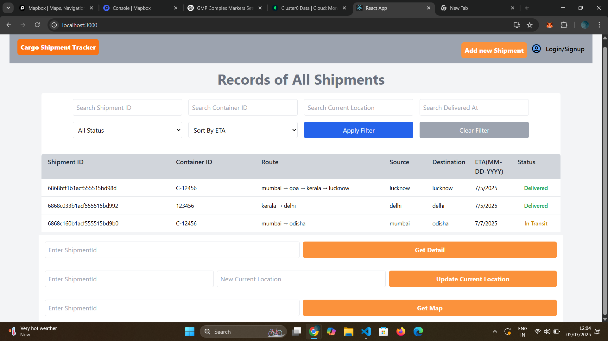
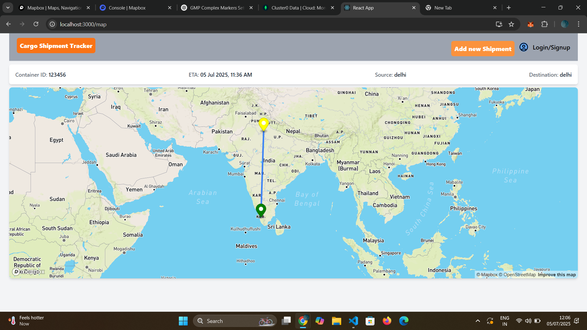
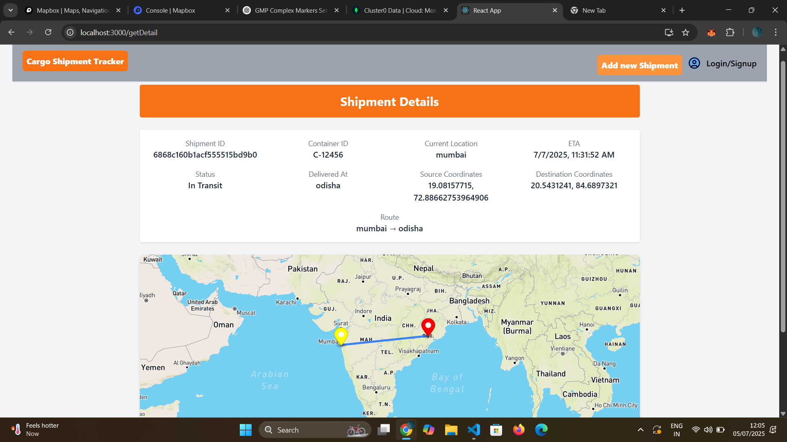
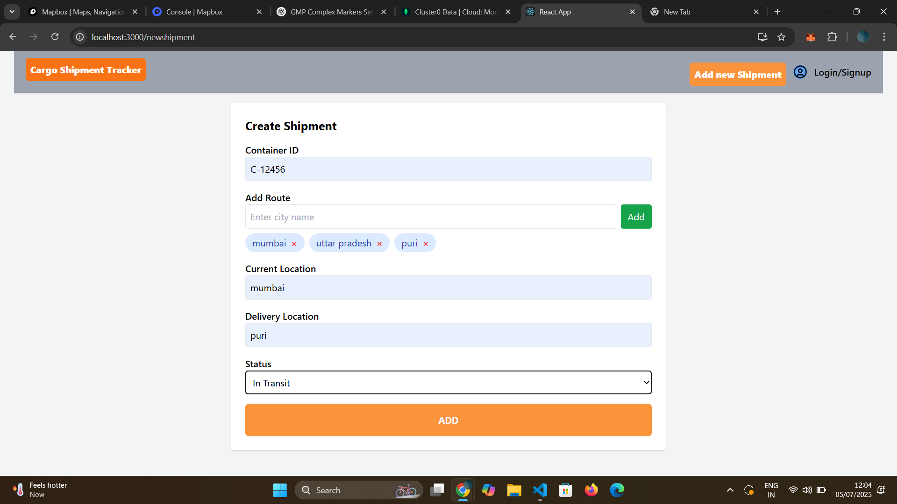

# 🚚 Cargo Shipment Tracker (Frontend)

A web-based Cargo Shipment Tracker built with **React**, **Mapbox**, and **Tailwind CSS**. This app helps users track cargo shipments visually on a map and manage their current status, ETA, and route.

---

## 📌 Features

- 🔍 **Filter Shipments** by Shipment ID, Container ID, Current Location, Delivery Status, and ETA
- 🗺️ **Map Route View** using **Mapbox GL** with:
  - Green marker: Source
  - Red marker: Destination
  - Yellow marker: Current Location
- 📄 **Detailed View** includes:
  - ETA
  - Source & Destination Coordinates
  - Route cities
  - Container ID & Status
- ✨ **Responsive Design** with Tailwind CSS
- ⚙️ **State Managed** with Zustand
- ✅ Realtime status updates supported (based on your backend)

---

## ⚙️ Tech Stack

| Layer         | Tech                          |
|---------------|-------------------------------|
| Frontend      | React                         |
| Styling       | Tailwind CSS                  |
| Maps          | Mapbox GL                     |
| State Mgmt    | Zustand                       |
| Date Utility  | Moment.js                     |
| HTTP Client   | Axios                         |
| Routing       | React Router DOM              |
| Cookies       | js-cookie                     |
| Notifications | react-hot-toast               |

---

## 🧩 Project Structure
```bash
📦 frontend/
├── 📂 public/
├── 📂 src/
├── 📂 screenShots/
├── .env
├── .gitignore
├── README.md
├── package.json
├── package-lock.json
└── tailwind.config.js
```

## 1️⃣ Install Dependencies
```bash
npm install
```

## 2️⃣ Setup Environment Variables
Create a .env file in the project root:
env

```bash
REACT_APP_MAPBOX_TOKEN=your_mapbox_token_here
```
🔑 Get your token from https://account.mapbox.com/

## 3️⃣ Run Locally
```bash

npm start
```
Open http://localhost:3000 to view it in the browser.


## 🖼️ UI Screenshots

### 🏠 Home Page (Shipment List + Filter)


---

### 🗺️ Shipment Route on Map


---

### 📋 Shipment Detail View by ID


---

### ➕ Add New Shipment


## 👨‍💻 Author
Made with ❤️ by SUHANA GUPTA
